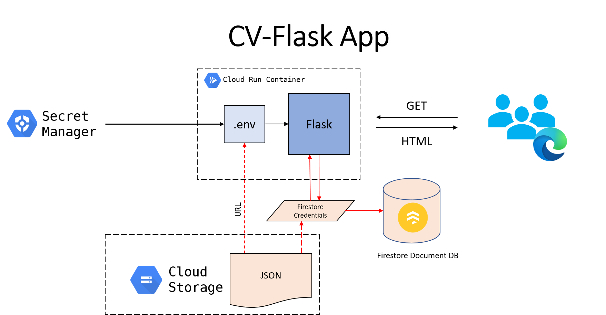

# My Curriculum Vitae Website (now in Flask).

This is a website created for my Curriculum Vitae.

For my portfolio, see https://marvintensuan.github.io/

**Related repository:** [cv-django](https://github.com/marvintensuan/cv-django)

## Overview

There were many reasons why I had to create a Flask version of my `cv-django` project. First and foremost is the _cost_. Cloud SQL instances are expensive, and for an app whose sole purpose is to serve static files, I didn't think it's worth it.

Hence why I chose `Flask` and `Firestore`. Flask not being bulky means less storage use and Firestore is a serverless service with free tier. Django also doesn't natively support document databases.

Another thing that's different this time is the way I deployed the app. This website is deployed directly from VSCode (instead of using the built-in cloud shell editor).

## How To Build

### Flask on Cloud Run

The official [Flask tutorial](https://flask.palletsprojects.com/en/1.1.x/tutorial/) uses an application factory pattern. That is not required; a single `app.py` file will do.

Required dependencies include:

- `gunicorn` - for deploying the app. Earlier versions of the flask app were deployed via `python app.py` and the project got suspended on GCP due to "cryptocurrency mining".
- GCP SDKs `google-auth`, `google-cloud`, and `google-cloud-firestore`. Firestore (Native) is our document database. Environment variables are saved via Secrets Manager.
- `python-dotenv` loads .env file into the app.

### Setting up Firestore

- Firestore database should be in the same project as where you deployed the Flask app, for convenience.
- Create a service account using [this guide](https://cloud.google.com/firestore/docs/quickstart-servers). This will grant your Flask app with the configured access to the Firestore database. After this, you should be able to download a JSON file.
- Create a new bucket on Cloud Storage. In this bucket, upload the JSON file. Once done, click the file to see the object details. Look for the "Authenticated URL" and add it to Secrets Manager as `GOOGLE_APPLICATION_CREDENTIALS`.

### Secrets Manager

- Secrets Manager contains your environment variable, which will be conterted by `main.py` into a .env at runtime. These variables include `PORT`, `SECRET_KEY`, `DEBUG` and of course, `GOOGLE_APPLICATION_CREDENTIALS`. 

### Others

There are definitely topics which were glossed over (e.g. setting up a GCP project). For all things Google Cloud, the documentation for each product is enough. There are also GCP-related topics found at Stack Overflow. Same goes with Flask.

## Project History

. . . (continued from [cv-django](https://github.com/marvintensuan/cv-django#History) README.)

2021-02-12 &mdash; deployed https://mrvn-flask-service-qmtxf7rosq-de.a.run.app/. Created repository `cv-flask`.

2021-02-13 &mdash; migrated data from Cloud SQL to Firestore. See [migration script](https://github.com/marvintensuan/My-Data-Migrations/tree/master/2021-02-09%20postgresql_to_firestore).

